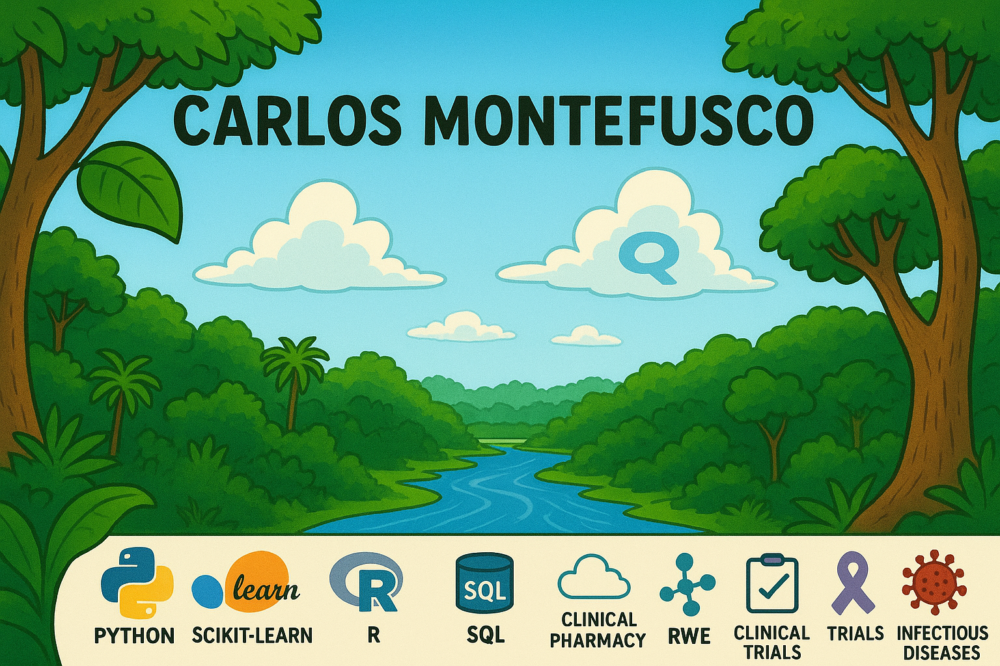

# Hi there, I'm Carlos 👋 (he/him)

## About Me 🔬💡

Aspiring pharmacometrician and data scientist | Python, SQL, R, SAS, Scikit-Learn | 6+ years in clinical trial and late-stage drug development of biologicals | PhD PharmaTech, M.Sc. Forensics, Pharmacist

I’m Carlos Montefusco Pereira – a pharmacist and researcher with 10+ years of cross-functional experience in drug development, 6+ of those in the pharmaceutical industry. With a PhD in pharmaceutical technology, I specialize in nanoparticle-based drug delivery, clinical pharmacology, and data-driven methods such as pharmacometrics and statistical modeling.

I’ve contributed to over 30 global clinical trials, led international research teams, supported regulatory filings (INDs, CTAs, MAAs), and worked with major players like BioNTech, Boehringer Ingelheim, and WHO. My mission? To bridge science, strategy, and data for better therapeutics.

- 🔭 Currently exploring: **Pharmacometric modeling, data pipelines, clinical/commercial intelligence and app building for the pharmaceutical industry**
- 📍 Focus: Biologics, GxP/CMC development, clinical modeling, and regulatory strategy
- 🤝 Open to roles in **pharma, biotech, M&S, and clinical pharmacology**

📫 Let’s connect: [LinkedIn](https://www.linkedin.com/in/carlos-montefusco-pereira-dr/) | [GitHub](https://github.com/camontefusco)

---

## 🧠 Skills Snapshot

| Domain                   | Tools & Technologies |
|--------------------------|----------------------|
| **Data Science**         | SQL, R, Python, ggplot2, pandas, Azure, scikit-learn, TensorFlow |
| **Pharmacometrics**      | R, nlmixr2, NONMEM, mrgsolve |
| **Drug Development**     | GxP/CMC, regulatory filings, biologics, mAbs, ADCs, mRNA vaccines, CAR-T |
| **Clinical Experience**  | Clinical pharmacy, oncology/immunology/infectious diseases trials, M&S |
| **Communication**        | Scientific writing, regulatory documents, interdisciplinary leadership |

---

## 📚 Publications & Experience

- 🧾 18+ scientific publications  
- 🌍 WHO consultant – global health & policy  
- 💼 Experience: BioNTech SE, Boehringer Ingelheim, WHO  
- 🧪 Led cross-functional research teams across 5+ countries  
- 👨‍🏫 Mentored 10+ junior scientists  

---

## 🤝 Let’s Connect

💬 Open to collaborations in pharmacometrics, clinical modeling, biologics, and data-driven drug development.
